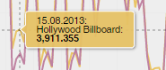

# AZoomableDateTime - Visualization for MicroStrategy Dossier

AZoomableDateTime is a flexible custom visualization to display one or more Metrics along a Datetime, Date or Category-Axis while allowing to zoom and pan along the X-Axis. With this custom visualization you can easily create Timeline-Series or Category-Series, which can be zoomed and panned. The Visualization is based on the amcharts.com library currently utilizing Version 4.
This visualization is free to use.

## Requirements

### Object requirements:
  - Attributes: 1
  - Metrics: 1 - n metrics

### Minimum MicroStrategy version: 10.2

### Current visualization version: 1.0

### MicroStrategy Features
  - [Supports using a visualization as a selector][VisAsSelector]
  - [Supports exporting engine  (10.6 and later)][ExportingEngine]

### Additional Features
  - Supports annotations with titles and subtitles
  - To enable annotations, create an attribute whose name begins with the prefix "Title_" and append to the prefix the name of the metric that the annotation will be associated with - for example, Title_Cost. You can also create a second attribute with the prefix "Subtitle_". Drag one or both of these metrics to the Annotations drop zone on the Editor panel.
  - Works as time series widget when no annotations are present

### Initial post: 08/23/2020
### Last changed: 11/19/2021
### Changes made: [Change Log Details]

# Basic Usage
The visualization requires at least 1 attribute and 1 metric.

**Attribute-Forms:**

Currently three Attribute-Forms are supported: 

- Categories
- Date(dd.MM.yyyy) 
- DateTime(dd.MM.yyyy HH:mm) 

The Time Attribute for DateTime needs to be sorted ASC. In addition to the time-Attribute you can have an additional categorical attribute which will then be used for a break-by. Break-By is only possible with one metric.

The Viz can process either of the two combinations:

- 1 (Time)Attribute and 1 or more Metrics
- 2 (Time)Attributes and 1 Metric

# Format Panel
## amChart Timeline Options
**WheelScroll behavior:** Allows for setting the action taking on wheel scrolls: none, pan, zoom.

**Date Strucuture:** separator doesnt matter

### Legend:

The Legend can be switched on or off. Its position can be changed (left, right, top, bottom). The “Legend Padding” can be used to adjust the spacing of the legend items. Max width and max height can be set to control the overall size of the legend and either create breathing or use space more efficiently. If the vertical space for the legend becomes too small a scrollbar appears. However as of Aug 2021: “Horizontal scrolling of legends is not (yet) supported”. The Marker Size can be adjusted freely, even though values between 20 and 40 seem to be most useful. 

“Values in Legend” allows for Metric-Values to be presented right next to the corresponding Series in the Legend. This will switch off Tooltips on the Graph. Basically it acts as a static tooltip incorporated into the legend.

### Options:

**Show XY-Cursor (enables Zoom)** is pretty much self-explaining. 

**Hide Cursor Lines** deactivated the cross hairs when hovering over the Chart.

**Show Axis Tooltip** enables/disables the current position of the cursor on the axis.
format sets how dates should be represented. Eg: “dd.M (eee)”

**Full Width Cursor** shows a X-Bar in full unit width instead of a hair line.

**Show XYChartScrollbar**:

A scrollbar at the bottom with two handlers.

**Show Selector**:

**Hide Y-Axis-Labels** removes the labels on the Y-Axis.

**Drill on Click (X-Axis)** allows for double click on month to zoom in.

**Single Tooltip**: displays just the closest value:

**Combine Tooltip**: combines values into one tooltip. Combining tooltips is only possible with single tooltip active.

**Visualization as Selector** if enabled, the Visualization can be used as a selector. The range zoomed to or the visible range will then be used to filter other visualizations.

**Baseline (Y=0)**: either the Visualization determines the range of the Y-Axis depending on the displayed values or the Y-Axis always starts at Zero.

**Stacked Series** (category-Axis only): allows to stack series rather than showing them next to each other.

**Enable Data Grouping:**

Groups data items when zoomed out automatically into larger periods, using some configurable aggregate value (à Aggregation (X-Axis))

**Aggregation (X-Axis):**

sum, avg, open, close, min, max).
### Show item labels
(category-Axis only): Positions item labels on each bar. Available positions: left, right, center, top, bottom, middle.
### Show weekend
If enabled, in the graph colored vertical blocks will be placed on the x-Axis to highlight the weekend (saturday and Sunday). These highlights will be shown as soon as the granularity of the x-Axis is equal or below 1 day unit. As long as days are grouped together the highlight will not be active.

### Min Grid Distance
Minimum distance in pixels between grid elements. Use it to control density of the grid/labels on the axis.element.

## amChart Timeline Format
### Customizting fills
Fill area underneath line. Can have a value between 0 and 10, where 1 = 10%. Has no effect on the bar chart variant.
### Fonts and Colors

|Gridline-X|Grid lines color X-Axis|
| :- | :- |
|Gridline-Y|Grid lines color Y-Axis|
|Axisline-X|Base Axis line color X-Axis|
|Axisline-Y|Base Axis line color Y-Axis|
|Axis Font|categoryAxis labels, dateAxis labels, valueAxis labels, combined tooltip labels|
|Label Font||
|Selector font||
|Selector Background||
|Scrollbar thumb||
|Scrollbar unselected||

### Options

## Metric Options
### Metric Colors and Axis
For each metric in the graph you can define a color, transparency, a metric format and a opposite Axis.

**Metric Format**: This will try to change the formatting of the metric according to the pattern selected.

**Opposite Axis**: This will generate an axis on the right side for the selected metric.

[VisAsSelector]: <https://lw.microstrategy.com/msdz/MSDL/_CurrentGARelease/docs/projects/VisSDK_All/default.htm#topics/HTML5/Using_Vis_As_Selector.htm>
[Change Log Details]: <https://github.microstrategy.com/AnalyticsSDK/Visualizations/blob/next/GoogleAnnotationChart/CHANGELOG.md>
[ExportingEngine]: <https://lw.microstrategy.com/msdz/MSDL/_CurrentGARelease/docs/projects/VisSDK_All/Content/topics/HTML5/Exporting_to_PDF.htm>

